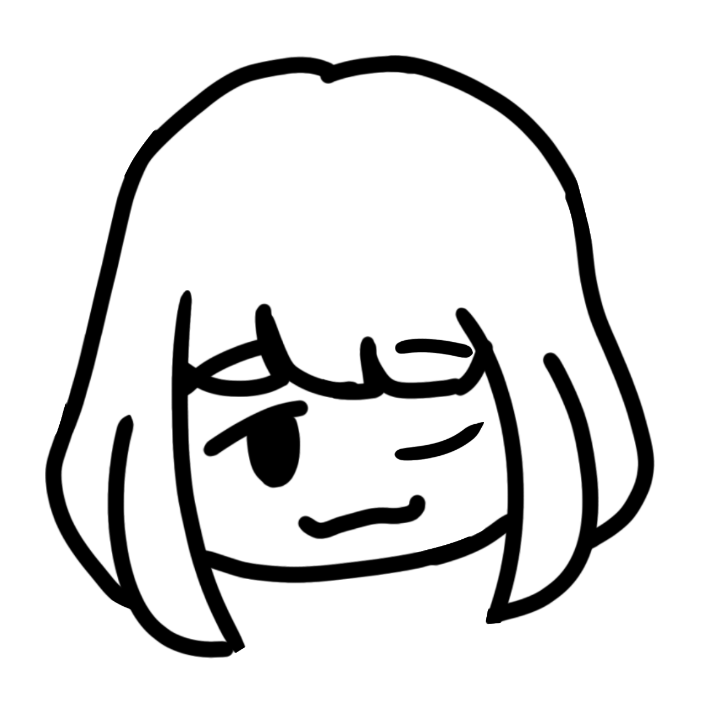

HI! My name is Norman Andrians,
I am a 15 year old developer and artist, i study game development, app, web, and also i study about drawing art
like anime, landscape, and painting. not only that I also study 3d models and 3d animation. 

well, I've been studying for 3 years but I'm still a beginner hehe 👀

I used to work on some projects I wanted by myself without anyone's help, that's because I didn't always have friends who had the skills I wanted. Even if I have a friend who has expertise I think maybe he doesn't want to work with me or he will work with me as long as there is a fee

