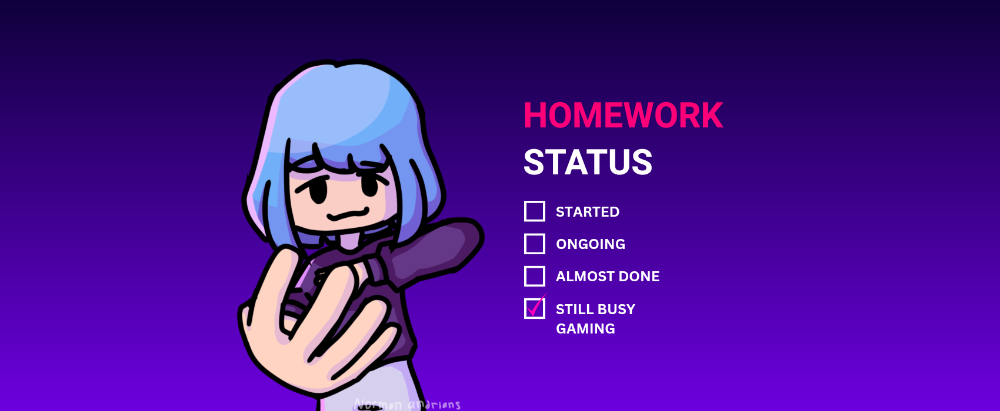
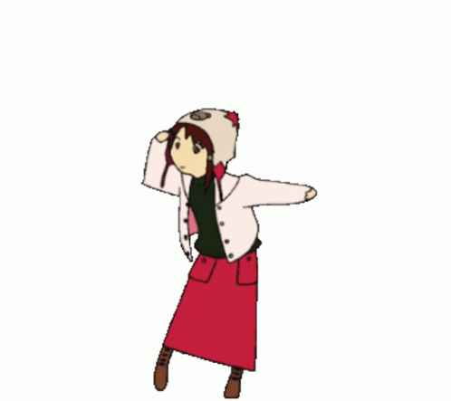

---

Don't call me programmer even software developer. Just 17yo coder who want to be an artist, high school student from Indonesia. Love building website, games, and some IoT stuff

[&label=Listening%20To&color=rgb(30%2C215%2C96))](https://future.lnk.to/WEDONTTRUSTYOU)

*not sponsored lol

Sorry guys, but in this 2024 i lost my confidence

Guys! checkout these gifs :D

  
  
  
  
  
  

---

Follow my [facebook](https://www.facebook.com/nominonsense/), i'm always active there